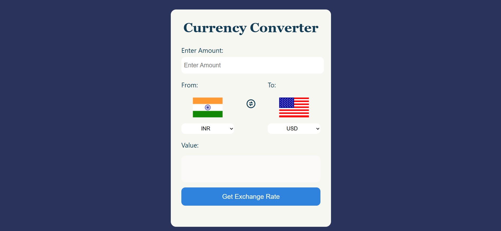
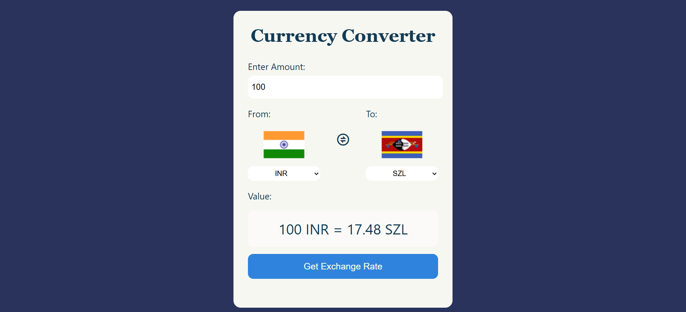
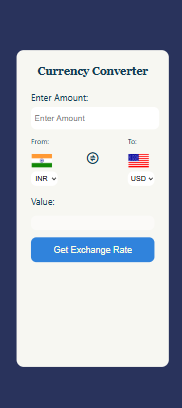

# Currency-Converter
This is a helpful Currency Converter which can be used to convert any amount from one currency to another.

## Tech Stacks
1) HTML
2) CSS
3) JavaScript
4) API : ExchangeRate-API (https://www.exchangerate-api.com)

## Features
- Conversion for upto 165 currencies.
- Up-to-date conversion rate.
- Instant value currency conversion between any two currencies.
- Added Swap Functionality to swap currencies.

## How To Use
1) Import Method:
- Import all the files into the local system using git or download as zip.
- Click on "index.html"
- Use The Tool

2) Direct Method:
- Click on "https://rohit-kumar-0407.github.io/Currency-Converter/" to access through deployed website.
- When danger pop appears, click on "More"
- Click on "visit Unsafe website"
- Use The Tool

## Project Screenshots

 
### Feel free to contact for feedback and suggestions.
